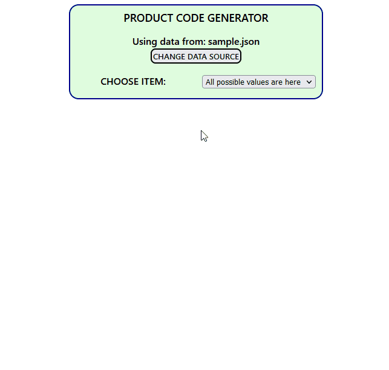

# ProductCodeBuilder

Author: Edgars Berzins

## About

ProductCodeBuilder provides the functionality to load specific structure JSON data (by default it imports /src/sample.json file), select items and their variations, and generate a product code based on the selected options. It handles file uploads, validates the JSON data structure, and displays appropriate messages to the user.

  <b> Code generator </b> 
  

## Installation and Setup Instructions

To run the ProductCodeBuilder project, please follow the steps below:

- Download the project repository.
- Ensure you have installed [Node.js](https://nodejs.org) on your system.
- Locate the startApp.bat file in the project directory.
- Double-click on the startApp.bat file to execute it.
- The batch file will check if the project directory contains the node_modules folder. If not, it will automatically execute npm install to install the project dependencies.
- Once the dependencies are installed, the batch file will automatically execute npm start to start the React development server.
- The application will be accessible in your browser at http://localhost:3000.

Or you can try it online: [ProductCodeBuilder](https://product-code-builder.vercel.app/)